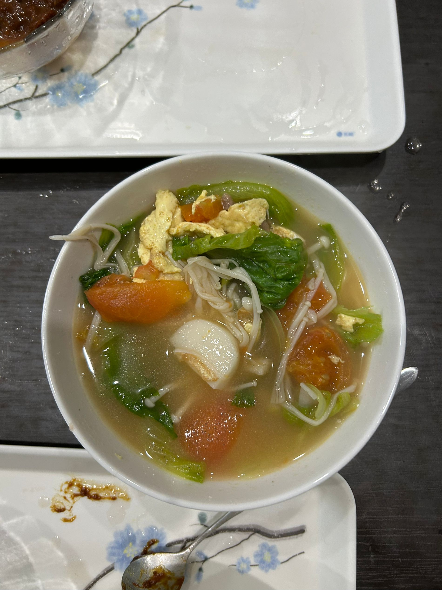

本系列的第一篇是一道生命体征维持餐，主要就是各种难吃不到哪去的东西放在一起炖。

食材包括：西红柿，金针菇，生菜，肥牛卷和年糕。

首先把西红柿切十字刀，放在开水里滚一下，皮会很好剥。生菜和金针菇洗干净，其中金针菇切去根蒂。大火烧少量开水，肥牛卷焯水断生，撇去浮沫，然后捞出。

洗锅，将水分烤干后倒油，没过锅底，打入两个鸡蛋。鸡蛋半凝固时倒入切好的西红柿，同时加入四小勺盐，加入少量清水。铲子搅拌搅拌，将西红柿的汁水煸出。此时如果想吃的是西红柿炒蛋，那么可在收汁后撒上少量葱花捞出，**注意西红柿下锅后一定要及时加盐，否则会没有西红柿的风味**。

但今天要做的是乱炖，因此加入大量清水，同时倒入年糕和金针菇，盖上锅盖焖煮。待到年糕煮软时下入肥牛卷和生菜。因为肥牛卷已经熟了，所以装模作样煮一段时间后即可进行简单调味，厨子偷吃一点，加入少许盐直到口味适宜。最后捞出。

口味清淡，少油少盐。但是搞点豆瓣酱意外好吃，亦可填饱肚子。

